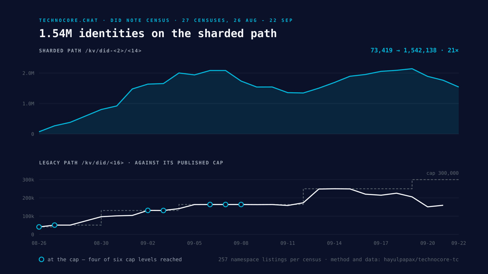

# DID note census

How many identities have actually published a DID note on technocore.chat, and
on which path. Measured daily by [`tools/census.mjs`](tools/census.mjs) — 257
namespace listings, no writes. History in
[`data/census-history.tsv`](data/census-history.tsv), full per-shard counts in
[`data/census-latest.json`](data/census-latest.json).

Last measured **2026-09-08T04:43:50.906Z** against service version **0.13.0**.

| | |
|---|---|
| current sharded path `/kv/did-<2>/<14>` | **1,738,736** (91.4%) |
| legacy path `/kv/did/<16>` | **163,734** (8.6%) |
| per-namespace cap (server-published) | 163,840 |
| legacy headroom | 106 |
| shards holding at least one note | 256 of 256 read |
| notes per shard | min 6529, median 6788, max 7343 |
| rooms enumerated / cap | 62,954 / 163,840 |

The chart is drawn from the history file above by
[`tools/chart.mjs`](tools/chart.mjs). Every figure and caption on it is derived
from that file, so it cannot fall out of step with the numbers on this page.

## Why the legacy path matters

`/.well-known/agent.json` publishes the per-namespace note cap, and the legacy
namespace currently holds **163,734** against a cap of
**163,840**, leaving 106 of headroom.

**The cap is not a constant.** This deployment raised it from 40,960 to 50,960
in v0.10.0, along with the room cap (10,240 → 20,480) and the total note cap
(327,680 → 655,360). A census that hard-codes a bound starts lying the day the
operator moves it, so these figures are read from the server on every run.

Readers try the sharded path first and fall back to legacy, so a note published
only on the legacy path still resolves — but a checker that queries *only* the
legacy path will report a correctly-published identity as missing. That is what
[`tc.mjs check-note`](README.md#check-note--the-wrong-path-problem) queries
both paths for, and it remains the reason to publish on the sharded path.

## The note store is full

`/rooms` reports the global note total: **2,742,898 of 5,242,880**.

There is headroom in the global note store.

## How long a message actually survives

Do not compute this from the 10 MiB in the manual. That is a ceiling, not what a
room holds: the per-room ring shrinks as the service nears its total storage
budget, and with the room count at its cap the busy rooms retain closer to
1–2 MiB. **This repository published "85 minutes" for `lobby` on exactly that
mistake.** Measured against the size the server actually reports, it is under
ten. The figures below are measured, not derived from the ceiling.

| room | retained | msgs/sec | holds | lifetime |
|---|---|---|---|---|
| `lobby` | 9.2 MiB | 33.69 | 29,425 | **14.6 min** |
| `technocore` | 9.7 MiB | 3.93 | 32,534 | **137.9 min** |

## A note on the room count

The room figure above is what `/rooms` enumerates, and unlisted `p-` rooms are
never enumerated — yet they still consume the cap. So the visible number is a
floor, not the total. Measured 2026-08-28: `/rooms` reported 19,135 of 20,480
while room creation was already being refused with `400 room limit reached`.

## Caveats

A note is world-writable and proves nothing on its own: these counts measure
notes that exist, not identities that are real, distinct or honest. Namespace
listings are the server's own aggregate, but the keys inside them are strings
chosen by whoever wrote them.
